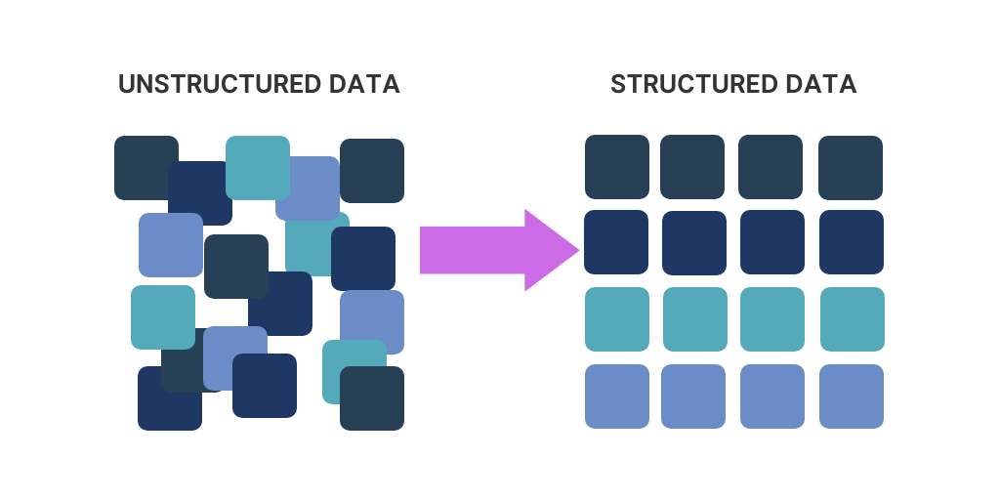

# Extracting Structured Data from Unstructured Text Using Dynamic Techniques



In today's data-driven landscape, the ability to extract structured information from unstructured text is more crucial than ever. Businesses continually seek ways to derive meaningful insights from vast amounts of raw text—be it customer feedback, research reports, or communication logs. The persistent challenge remains: how can we transform messy, unorganized data into something structured and actionable?

Fortunately, the advent of Large Language Models (LLMs) has made this task significantly more attainable. Frameworks like LangChain, LlamaIndex, and Guardrails AI provide powerful tools aimed at this objective. However, a common hurdle found in their documentation is the requirement to define a Pydantic model before any information extraction can occur. This entails specifying variables, data types, and descriptions in advance—a process that can become time-consuming and often necessitates programming expertise.

To address this, I developed an approach that streamlines the process, eliminating the need for predefined models and making it easier for businesses to extract the data they need without the overhead.

___
## Understanding Pydantic

Pydantic is a Python library primarily used for data validation and configuration management in a declarative manner. It is widely employed to define and validate data models, where class definitions describe how data should be structured and what rules should be applied. This makes Pydantic an ideal tool for scenarios where structured data validation is necessary, such as when working with APIs, databases, or other data sources.

For more details, refer to the [Pydantic documentation](https://docs.pydantic.dev/latest/).
___
## Structured Output with LangChain

For the purposes of this demonstration, I will be using LangChain as the primary framework. However, the approach outlined herein is adaptable to any framework utilizing Pydantic models. The LangChain documentation on Structured Output provides guidance on efficiently creating a Structured Output Parser that facilitates data extraction.

Typically, the initial step involves defining a Pydantic model to structure the output. Consider the following example:

```python
from langchain_core.pydantic_v1 import BaseModel, Field
from langchain_openai import ChatOpenAI

class Joke(BaseModel):
    setup: str = Field(description="The setup of the joke")
    punchline: str = Field(description="The punchline to the joke")

model = ChatOpenAI(model="gpt-3.5-turbo-0125")
structured_llm = model.with_structured_output(Joke)

structured_llm.invoke("Tell me a joke about cats")

>>>>> Joke(setup='Why was the cat sitting on the computer?', punchline='To keep an eye on the mouse!')
```

As seen in the example above, the standard approach requires setting up a Pydantic model that defines the structure of the output. While this is effective, it introduces a couple of key challenges:

1. Time-Consuming Setup: Defining variables, data types, and descriptions for every new data extraction task can be a significant time sink, especially when dealing with complex or varied data.

2. Technical Dependency: This setup typically requires programming skills, which means involving developers whenever changes or new requirements arise, slowing down the process and increasing costs.

3. Lack of Flexibility: Fixed models can struggle with variability in data or when scaling to new use cases, as they are not designed to adapt dynamically to different types of input.

For more details, you can refer to the documentation here: [LangChain Structured Output](https://python.langchain.com/v0.1/docs/modules/model_io/chat/structured_output/).
___
## Introducing Dynamic Structured Output

So the main idea is to create a dynamic application that accepts the text and a list of keywords. Leveraging an LLM, this application will extract relevant information corresponding to the specified keywords, followed by validating the extracted data via a dynamically created Pydantic model.

For instance, consider the following sample contract text:

```python
contract_text = (
    "Acme Corporation, identified by its EIN 12-3456789, has entered into a service agreement with Beta Solutions, LLC. "
    "The contract, valued at $150,000, outlines the terms for consulting services to be provided over a period of one year. "
    "The start date of the contract is October 1, 2024, and the parties have agreed that payments will be made quarterly. "
    "Contact information for Acme Corporation includes their primary address at 123 Main Street, Springfield, and the contact person is John Doe, reachable at john.doe@acme.com."
)

extraction_keywords = [
    "Contract value",
    "EIN (Employer Identification Number)",
    "Company names",
    "Service description",
    "Contract duration",
    "Contract start date"
]

extraction_payload = {
    "text": contract_text,
    "keywords": extraction_keywords
}

extracted_data = dynamic_data_extractor(extraction_payload)

print(extracted_data)

>>>>> {'properties': {'Contract value': 150000,
  'EIN (Employer Identification Number)': '12-3456789',
  'Company names': ['Acme Corporation', 'Beta Solutions, LLC'],
  'Service description': 'Consulting services',
  'Contract duration': 'one year',
  'Contract start date': 'October 1, 2024'}}
```

To overcome the constraints imposed by static models, we can dynamically create Pydantic models using the `create_model()` method from Pydantic. Here’s how:

```python
from pydantic import create_model, Field

fields: Dict[str, Any] = {}

ein_description = "EIN, or Employer Identification Number, is a unique nine-digit number assigned by the IRS to identify a business entity."

fields["EIN"] = (str, Field(default=None, description=ein_description))        

pydantic_model = create_model("EIN Model", **fields)

print(pydantic_model.schema_json())

>>>>> {"properties": {"EIN": {"default": null, "description": "EIN, or Employer Identification Number, is a unique nine-digit number assigned by the IRS to identify a business entity.", "title": "Ein", "type": "string"}}, "title": "EIN Model", "type": "object"}

```
To utilize this dynamic approach effectively, we must compile comprehensive details about each keyword, including its description and data type. In most cases, a default description like `"{keyword} present in the text."` suffices, using `str` as the default data type. However, we can also employ an LLM to generate precise descriptions and determine appropriate types for the Pydantic model.

### Harnessing Role Prompting for Enhanced Data Quality

The next step involves designing a Pydantic model aimed at data descriptions and data types. In this scenario, I utilized a PromptTemplate from LangChain to facilitate LLM interaction using Role Prompting—a technique where the LLM mimics a particular persona, such as a data scientist, to yield more relevant and accurate responses.

Here’s how we create the prompt template:

```python
class DataQualityAnalystModel(BaseModel):
    data_description: str = Field(default=None, description="Provide a detailed description of the keyword.")
    data_type: str = Field(default=None, description="Assign an appropriate Python data type to the keyword from the following options: int, float, str, or list.")

def create_data_quality_prompt(parser) -> PromptTemplate:
    system_prompt = dedent("""
        You are a Data Quality Analyst with decades of professional experience.
        Your responsibilities include ensuring data quality, identifying the correct data types, and maintaining the Data Dictionary.

        Based on the provided keyword, answer the question. If the text does not contain a specific value, return null.
    """)

    return PromptTemplate(
        template=system_prompt + "\n{format_instructions}\nkeyword: {keyword}\n",
        input_variables=["keyword"],
        partial_variables={"format_instructions": parser.get_format_instructions()},
    )

parser = JsonOutputParser(pydantic_object=DataQualityAnalystModel)
prompt = create_data_quality_prompt(parser)

prompt.pretty_print()

>>>>>You are a Data Quality Analyst with 20 years of professional experience.
Your responsibilities include ensuring data quality, identifying the correct data types, and maintaining the Data Dictionary.

Based on the provided keyword, answer the question. If the text does not contain a specific value, return null.

The output should be formatted as a JSON instance that conforms to the JSON schema below.

As an example, for the schema {"properties": {"foo": {"title": "Foo", "description": "a list of strings", "type": "array", "items": {"type": "string"}}}, "required": ["foo"]}
the object {"foo": ["bar", "baz"]} is a well-formatted instance of the schema. The object {"properties": {"foo": ["bar", "baz"]}} is not well-formatted.

Here is the output schema:
\```
{"properties": {"data_description": {"default": null, "description": "Provide a detailed description of the keyword.", "title": "Data Description", "type": "string"}, "data_type": {"default": null, "description": "Assign an appropriate Python data type to the keyword from the following options: int, float, str, or list.", "title": "Data Type", "type": "string"}}}
\```
keyword: {keyword}
```
Once the prompt is established, a chain will be created that combines the LLM, the prompt, and the output parser, ensuring a comprehensive data extraction process that dynamically adapts to the provided keywords.

### Example Implementation and Results
Here is how the chaining function works:

```python
def create_chain(keyword: str, prompt: PromptTemplate, parser: JsonOutputParser, llm: ChatOpenAI) -> Dict[str, Any]:
    chain = prompt | llm | parser
    return chain.invoke({"keyword": keyword})

def parse_model_result(result: Dict[str, Any], keyword: str) -> Dict[str, Any]:
    try:
        data_type = eval(result["data_type"])
    except Exception:
        data_type = str
    return {
        "keyword": keyword,
        "data_description": result["data_description"],
        "data_type": data_type
    }
```
Once we’ve populated our data with keywords, we can easily generate a Dynamic Pydantic Model:

```python
def generate_dynamic_dict_for_pydantic_model(keyword: str, llm: ChatOpenAI) -> Dict[str, Any]:
    try:
        parser = JsonOutputParser(pydantic_object=DataQualityAnalystModel)
        prompt = create_data_quality_prompt(parser)        
        result = create_chain(keyword, prompt, parser, llm)
        return parse_model_result(result, keyword)
    except Exception:
        return {
            'keyword': keyword,
            'data_description': f"{keyword} present in the text.",
            'data_type': str
        }

def create_pydantic_model_from_dict(pydantic_data: List[Dict[str, Any]], model_name: str = "DynamicModel") -> Any:
    try:
        fields = {
            field["keyword"]: (field["data_type"], Field(default=None, description=field["data_description"]))
            for field in pydantic_data
        }
        return create_model(model_name, **fields)
    except ValueError as e:
        print(f"Error: {str(e)}")
        return None
    except Exception as e:
        print(f"Unexpected error: {str(e)}")
        return None
```
LangChain's inherent flexibility in supporting Large Language Models (LLMs) from a variety of providers offers considerable versatility within the framework. This feature empowers developers to tap into the unique strengths and attributes of different language models, tailored to meet the specific needs of their applications. For instance, I have successfully employed both Bedrock and OpenAI models in my previous projects, each bringing its own distinct advantages to the table.

In this demonstration, I will focus on utilizing the GPT-4o-mini model from OpenAI. To get started, we will instantiate the `ChatOpenAI` class, specifying the model ID and adjusting the temperature parameter.

The temperature setting plays a crucial role in controlling the balance between predictability and creativity within the generated text. A lower temperature value encourages the model to rely on established patterns, resulting in more deterministic and conservative outputs. In contrast, a higher temperature value promotes exploration, allowing for a greater degree of diversity and innovation in the generated content.

Since our primary goal is to extract information with the utmost accuracy, we will set the temperature to 0. This approach guarantees that the model produces highly predictable and reliable outputs, aligning seamlessly with our objective of precise information extraction.

Now, let’s put this into practice by demonstrating the capabilities of the GPT-4o-mini model from OpenAI. We will instantiate the `ChatOpenAI` class and configure our model along with the temperature settings to optimize content generation and predictability:

```python
llm = ChatOpenAI(model="gpt-4o-mini", temperature=0)

keywords = [
    "Contract value",
    "EIN (Employer Identification Number)",
    "Company names",
    "Service description",
    "Contract duration",
    "Contract start date"
]

pydantic_data = [generate_dynamic_dict_for_pydantic_model(keyword, llm) for keyword in keywords]

print(pydantic_data)

>>>>> [{'keyword': 'Contract value', 'data_description': "The contract value refers to the monetary amount specified in a contract, which outlines the financial obligations of the parties involved. It can represent the total value of the contract or specific payments due at various stages of the contract's execution.", 'data_type': <class 'float'>}, {'keyword': 'EIN (Employer Identification Number)',...}]
```

Now, we can create a Dynamic Pydantic Model, and see the model schema.

```python
dynamic_model = create_pydantic_model_from_dict(pydantic_data)

print(pydantic_model.schema_json())

>>>>>{"properties": {"EIN": {"default": null, "description": "EIN, or Employer Identification Number, is a unique nine-digit number assigned by the IRS to identify a business entity.", "title": "Ein", "type": "string"}}, "title": "EIN Model", "type": "object"}
```

With the Dynamic Pydantic Model we only have to create a new Chain to extracting the informations using the dynamic_model, and we can send the text and the keywords.

```python

def dynamic_data_extractor(text:str, keywords: List[str]) -> Dict[str, Any]:
    llm = ChatOpenAI(model="gpt-4o-mini", temperature=0)

    pydantic_data = [generate_dynamic_dict_for_pydantic_model(keyword, llm) for keyword in keywords]
    print(pydantic_data)
    dynamic_model = create_pydantic_model_from_dict(pydantic_data)

    if dynamic_model:
        parser = JsonOutputParser(pydantic_object=dynamic_model)
        prompt = PromptTemplate(
            template="Based on the text below answer the question, if not a specific value return null\n{format_instructions}\n{keyword}\n",
            input_variables=["keyword"],
            partial_variables={"format_instructions": parser.get_format_instructions()},
        )

        result = create_chain(text, prompt, parser, llm)
        return(result)
```

We can now invoke it for data extraction with a single call:

```python
text = (
"Acme Corporation, identified by its EIN 12-3456789, has entered into a service agreement with Beta Solutions, LLC. "
"The contract, valued at $150,000, outlines the terms for consulting services to be provided over a period of one year. "
"The start date of the contract is October 1, 2024, and the parties have agreed that payments will be made quarterly. "
"Contact information for Acme Corporation includes their primary address at 123 Main Street, Springfield, and the contact person is John Doe, reachable at john.doe@acme.com."
)

keywords = [
    "Contract value",
    "EIN (Employer Identification Number)",
    "Company names",
    "Service description",
    "Contract duration",
    "Contract start date"
]

results = dynamic_data_extractor(text, keywords)

print(results)

>>>>> {'Contract value': 150000,
 'EIN (Employer Identification Number)': '12-3456789',
 'Company names': 'Acme Corporation',
 'Service description': 'consulting services',
 'Contract duration': 12,
 'Contract start date': '2024-10-01'}
```
## Conclusion

In summary, the method demonstrated for extracting structured data from unstructured text using dynamic techniques significantly enhances efficiency and flexibility for businesses seeking actionable insights. This dynamic approach, leveraging the strengths of LLMs and Pydantic, streamlines the data extraction process while minimizing technical dependencies and setup overhead. 

## My Links:
[Medium](https://medium.com/@lucasdacunh)
[LinkedIn](https://medium.com/r/?url=https%3A%2F%2Fwww.linkedin.com%2Fin%2Flucas-dacunha%2F)